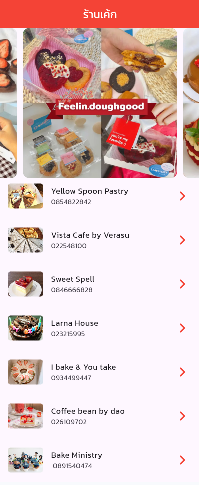
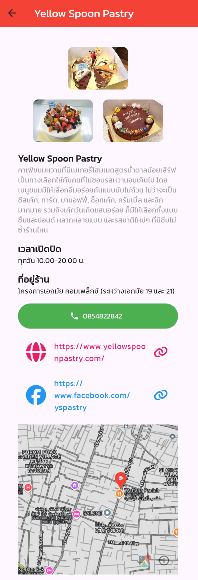
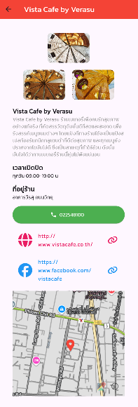
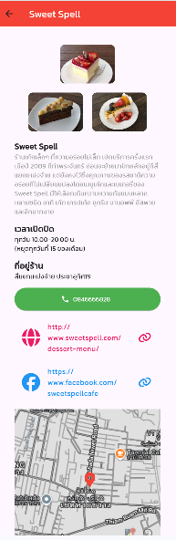
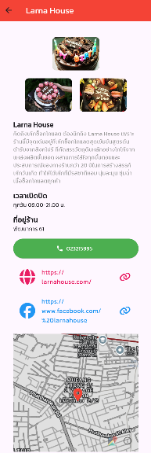
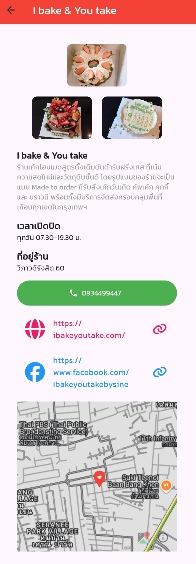
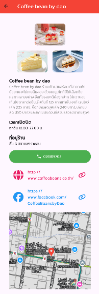
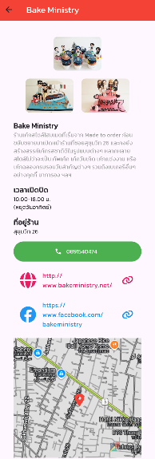

# 🍰 Kin Cake Kun App (แอปพลิเคชัน "กินเค้กกันเถอะ")

แอปพลิเคชันสำหรับสายหวาน! รวบรวมและแนะนำร้านเค้ก คาเฟ่เบเกอรี่ชื่อดัง พร้อมดูรายละเอียดร้าน ช่องทางการติดต่อ และพิกัดแผนที่ร้านได้อย่างสะดวกสบาย จบในแอปเดียว

## 🌟 ฟีเจอร์หลัก (Features)
- 🏠 **หน้ารวมร้านเค้ก:** แสดงรูปภาพไฮไลต์แบบสไลด์อัตโนมัติ (Carousel Slider) และรายชื่อร้านเค้กให้เลือกดูอย่างจุใจ
- 📖 **รายละเอียดร้าน:** แสดงภาพบรรยากาศร้าน ข้อมูลร้าน เวลาเปิด-ปิด และที่อยู่ครบถ้วน
- 📞 **ติดต่อรวดเร็ว:** มีปุ่มกดโทรออกไปยังร้านได้ทันที, พร้อมลิงก์เปิดหน้าเว็บไซต์ และ Facebook ของร้าน
- 🗺️ **แผนที่และการเดินทาง:** แสดงพิกัดร้านบนแผนที่ (Flutter Map) และสามารถกดที่หมุดเพื่อเปิดนำทางผ่าน Google Maps ได้ทันที

## 📸 ภาพตัวอย่างแอปพลิเคชัน (Screenshots)

  
  
  
  
  

  
  
  
  

---
**ผู้จัดทำ:** นาย ภควัตร เอมละออ (รหัสนักศึกษา: 6752410017)  
**คณะ:** ศิลปศาสตร์เเละวิทยาศาสตร์ | **สาขาวิชา:** การพัฒนาโปรเเกรมประยุกต์สำหรับอุปกรณ์เคลื่อนที่  
มหาวิทยาลัยเอเชียอาคเนย์